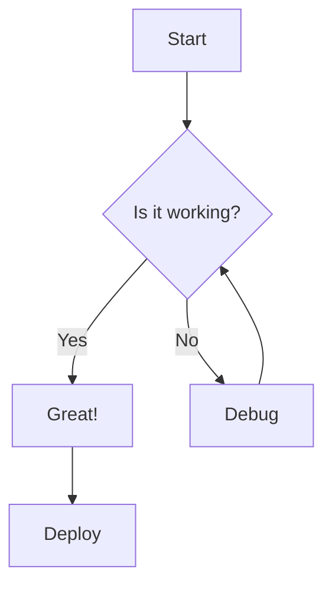
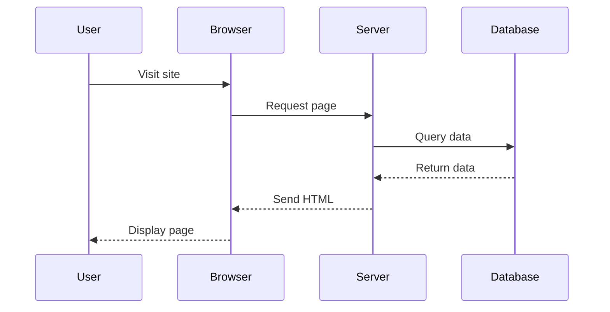
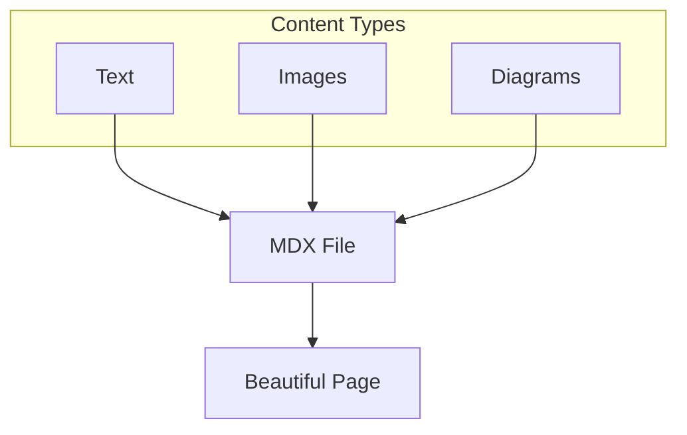

# Mermaid Diagrams & Images Example

This page demonstrates how to use Mermaid diagrams and images in your MDX content.

## Mermaid Diagrams

You can create diagrams using Mermaid syntax in code blocks:



### Flowchart Example


### Sequence Diagram



## Images

### Using Local Images

Place images in the `public/images/` directory, then reference them:

```markdown

```

### Using External Images

You can also use images from external URLs:

```markdown

```

Example:


## Combining Both

You can mix diagrams and images in the same document:



That's it! Now you can use both Mermaid diagrams and images in all your MDX files.

